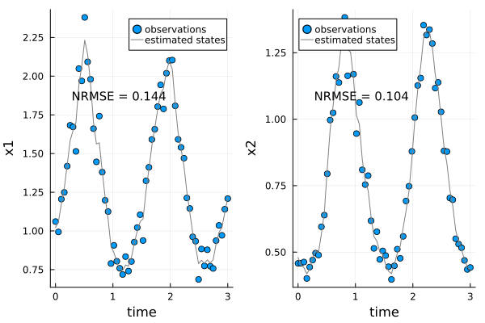

# UniversalDiffEq

[](https://github.com/jarroyoe/UniversalDiffEq.jl/actions/workflows/CI.yml?query=branch%3Amain)

UniversalDiffEq.jl builds [Universal Differential Equations](https://arxiv.org/abs/2001.04385) (UDEs) to learn nonlinear dynamics from time series data. The models and training routines are constructed to address several challenges common in ecology and environmental science. Our package uses [DiffEqFlux.jl](https://github.com/SciML/DiffEqFlux.jl) to implement UDEs. Models built with UniversalDiffEq.jl are constructed within a state-space modeling framework that simultaneously accounts for imperfect (noisy) observations and stochastic (unpredictable) dynamics. UniversalDiffEq.jl also builds training routines based on a state-space framework that can improve the performance of UDEs on data sets from open systems whose dynamics are determined by a combination of endogenous feedback mechanisms and stochastic external forcing. 
UniversalDiffEq.jl builds [Universal Differential Equations](https://arxiv.org/abs/2001.04385) (UDEs) to learn nonlinear dynamics from time series data. The models and training routines are constructed to address several challenges common in ecology and environmental science. Our package uses [DiffEqFlux.jl](https://github.com/SciML/DiffEqFlux.jl) to implement UDEs. Models built with UniversalDiffEq.jl are constructed within a state-space modeling framework that simultaneously accounts for imperfect (noisy) observations and stochastic (unpredictable) dynamics. UniversalDiffEq.jl also builds training routines based on a state-space framework that can improve the performance of UDEs on data sets from open systems whose dynamics are determined by a combination of endogenous feedback mechanisms and stochastic external forcing. 

The package provides one specific implementation of universal differential equations designed for systems with stochastic dynamics and noisy data. If you want to explore the technical details of UDEs and develop highly customized models, please use DiffEqFlux.jl instead.

UniversalDiffEq.jl is currently under development and not on the Julia registry. To install and load it, open Julia and type the following code:

```
]add https://github.com/Jack-H-Buckner/UniversalDiffEq.jl
using UniversalDiffEq
```

# Tutorial 
As a simple example to get started on `UniversalDiffEq.jl`, we fit a simple NODE model to a synthetic dataset generated with the classical [Lotka-Volterra model](https://en.wikipedia.org/wiki/Lotka%E2%80%93Volterra_equations).

```julia
using UniversalDiffEq, DataFrames

data,plt = LotkaVolterra();
model = NODE(data);
gradient_descent!(model);
plot_predictions(model)
plot_state_estimates(model)
```




Please see the documentation for a detailed tutorial (https://jack-h-buckner.github.io/UniversalDiffEq.jl/dev/).

# Acknowledgements


The development of this package is supported by the National Science Foundation, award \#2233982 on Model Enabled Machine Learning (MnML) for Predicting Ecosystem Regime Shifts.
