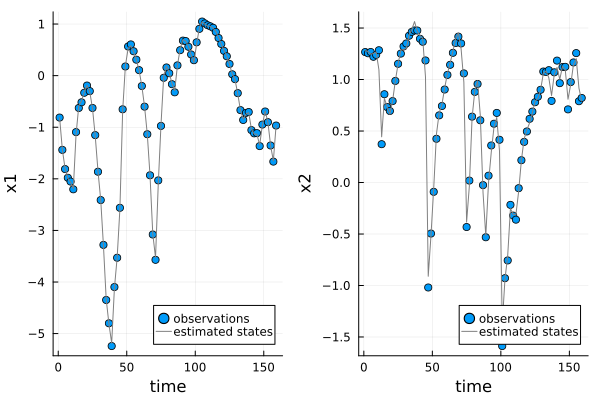

# Model performance

UniversalDiffEq.jl provides a number of functions to test the performance of NODE and UDE models on in-sample data. These tests validate the model fitting procedure. Functions to estimate the model's performance on out-of-sample data are discussed below and in the section on cross-validation.

## Evaluating model fits to training data

There are two primary functions to evaluate model fits: `plot_state_estimates` and `plot_predictions`. The training procedure used by UniversalDiffEq.jl simultaneously smooths the training data and trains the parameters of the UDE model on the smoothed dataset. The function `plot_state_estimates` compares the smoothed time series produced by the training procedure to the observations in the dataset. The smoothed time series (grey line) needs to capture the main trends in training data (blue dots) for the model to accurately recover the dynamics in the dataset (Fig. 1).



**Figure 1**: Model fit to simulated training data

```@docs; canonical=false
UniversalDiffEq.plot_state_estimates(UDE::UDE)
```

We can make this analysis a bit more rigorous by looking for correlations in the observation errors using the `observation_error_correlations` function. This creates a lag plot for each pair of variables in the model and calculates the correlation coefficent. Large correlations in the observation errors suggest the UDE model may be missing predictable variation in the dataset.

```@docs; canonical=false
UniversalDiffEq.observation_error_correlations(UDE;fig_size = (600,500))
```

The `plot_predictions`  functions compares the predictions of UDE model one step into the future to the estimated sequence of state variables. This function quantifies the predictive accuracy of the model for in-sample data.

```@docs; canonical=false
UniversalDiffEq.plot_predictions(UDE::UDE)
```

## Model forecasting with testing data

There are also functions to compare the model predictions to out-of-sample data. The simplest is `plot_forecast`, which compares the observations in the test dataset to a deterministic simulation from the dataset, which starts at the first observation and runs to the end of the test data.

```@docs; canonical=false
UniversalDiffEq.plot_forecast(UDE::UDE, test_data::DataFrame)
```

It is also possible to test the performance of the models one time step into the future using the `plot_predictions` function. When a test dataset is supplied to the `plot_predictions` function, it will run a series of forecasts starting at each point in the dataset, predicting one time step into the future. The function returns a plot comparing the predicted and observed changes.

```@docs; canonical=false
UniversalDiffEq.plot_predictions(UDE::UDE, test_data::DataFrame)
```
