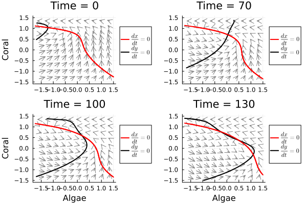

# Examples
## Using time-dependent NODEs to predict regime changes

One interesting use of NODE and UDE models in ecology is detecting and predicting regime changes, sudden shifts in the structure and function of an ecosystem caused by a small change in conditions. Regime changes are caused by the interaction of non-linear feedback mechanisms, environmental variability, and long-term environmental change. NODE and UDE models built with UniversalDiffEq.jl can capture all three of these processes, opening up the possibility of detecting and predicting regime changes from data.


In the following example, we build a NODE model for a two-species system that undergoes a regime change. The data are simulated from the Mumby et al. (2007) model of coral-algae competition with an added term for stochastic coral mortality events and a long-term increase in the coral mortality rate from increasing temperature. The increasing temperature eventually causes the system to shift from a coral-dominated to an algae-dominated state (figure 1). The data from the time of the regime change are used to fit the model.


The model is a function of the area covered by coral ``p_C`` and algae ``p_A``, an environmental covariate ``X`` that is related to coral mortality and time ``t`` to capture the effect of the slowly increasing coral mortality rate. The coral and macroalgae abundances are transformed to ``x_i = softmax^{-1}(p_i)`` using the inverse softmax transformation before fitting the model


```math
   \frac{dx_C}{dt} = NN_1(x_C,x_A,X,t) \\
   \frac{dx_A}{dt} = NN_2(x_C,x_A,X,t) \\
```


UniversalDiffEq.jl does not have built-in methods to construct time-dependent NODES, but they can be built easily using the `CustomDerivatives` function. In this case, we initialize a neural network that takes four inputs (one for each species, the environmental covariate, and time) and two outputs using Lux.jl. The derivatives function `derivs!` divides time by 50 to match the scale of the other inputs, then concatenates the abundances of each species, the covariate ``X`` and time into a vector, and evaluates the neural network. The UDE model is constructed using the `CustomDerivatives` function, passing both the species data in a data frame called `data` and the covariate in a data frame called `X`.

```julia
using Lux, UniversalDiffEq
# set neural network dimensions
dims_in = 4 
dims_out = 2
hidden = 10


# Define neural network with Lux.jl
NN = Lux.Chain(Lux.Dense(dims_in, hidden, tanh), Lux.Dense(hidden,dims_out))
rng = Random.default_rng() 
NNparameters, NNstates = Lux.setup(rng,NN) 
parameters = (NN = NNparameters,)


# Define derivatives (time-dependent NODE)
function derivs!(du,u,X,p,t)
    inputs = [u[1],u[2],X[1],t/50-1.0]
    vals = NN(inputs,p.NN,NNstates)[1]
    du[1] = vals[1]
    du[2] = vals[2]
    return du 
end 

model = UniversalDiffEq.CustomDerivatives(data[1:80,:],X,derivs!,parameters;proc_weight=2.5,obs_weight=10.0,reg_weight=10^-3.5)

gradient_descent!(model, verbose = true, maxiter = 250)
BFGS!(model, verbose = true )
```

We can use the `plot_state_estimates` and `plot_predictions` functions to test the fit of the model to the training data. 

```julia
UniversalDiffEq.plot_state_estimates(model)
```


```julia
UniversalDiffEq.plot_predictions(model)
```


Unsurprisingly, given that this is simulated data, our model was able to fit the training data very closely.


Given that the model fits the data well, we can move on to our analysis. The goal of this model is to capture the effects of a slowly changing variable on the dynamics of the coral-algae system. In particular, we want to identify any potential regime changes, points in time where a small change in the environment leads to a large change in the state of the ecosystem. Often, regime changes are characterized by the appearance or disappearance of equilibrium points in a dynamics system. We can identify these events by tracking changes in the derivatives function of the NODE model over time. This function is the right-hand side of a system of ODEs and, therefore, can be analyzed for equilibrium points and their stability. Because the NODE model is time-dependent, new equilibria may appear or existing ones may change their stability creating a regime change.


To identify regime changes, we can extract the right-hand side of the ODE from the fitted model using the `get_right_hand_side` function. In the following example, we use the derivatives function `RHS` to plot a vector field for the coral and macroalgae at four points in time.


```julia
using Plots
include("vectorfield.jl")
RHS = UniversalDiffEq.get_right_hand_side(model)

function vector_field_plot(t,X)
    field = (x,y) -> RHS([y,x],[X],t)

    grid = meshgrid(10) ./ 3 .- [2.0; 2]
    vectorfield2d(field, grid, arrowlength=0.25)
    return Plots.plot!(xlabel = "T(Algae)", ylabel = "T(Coral)", title = string("Time = ",t, " X = ", X))
end 

p1 = vector_field_plot(1,0.0)
p2 = vector_field_plot(40,0.0)
p3 = vector_field_plot(80.0,0.0)
p4 = vector_field_plot(120,0.0)
```


The vector plots show clear changes in the dynamics of the system over time that likely constitute a regime change from a coral-dominated state an algae-dominated state. For small values of time, the vector fields all point to the upper left, which is high coral abundance and low algae abundance. Over time, however, a second equilibrium appears in the lower right, low coral and high algae abundance. The final vector field, t = 120, predicts 40 years into the future after the end of the time series. This plot predicts that the basin of attraction around the algae-dominated state will continue to grow, which is consistent with the data, and shows a sudden switch from high coral to high algae abundance.

## Using UDEs to learn the dynamics of coupled human-natural systems

Natural resources like fisheries are examples of coupled human and natural systems; human activities influence the state of the natural system, and the environment influences human activities. One of the primary goals of coupled human-natural systems research is understanding how these cycles of mutual causation determine biological and social outcomes. We may also wish to understand how interventions from regulators modify interactions between people and their environment to identify if these interventions achieve their desired effects.


In this example, we build a UDE model to describe how the interactions between a fishing fleet and the exploited population change before and after the government limits entry into the fishery and predict the counterfactual outcomes in the absence of regulation.


### Data: US West Coast Cow Cod Fishery
For this example, we use data from groundfish fisheries on the west coast of the United States. These fisheries were managed under an open-access framework until 1992 when entry into the fishery was restricted following large declines in catch and abundance. We gathered data on the stock biomass ``B`` and harvested ``H`` from the RAM legacy database and coded the change in regulations using binary variable ``I_{LE}`` that switched from zero to one in 1992 when limited entry regulations began. The time series of these three variables are shown below.

```julia
using CSV, Plots, DataFrames
data = CSV.read("CowCodFishery.csv",DataFrame)
plt = Plots.scatter(data.t,data.y, label = "log Abundance", xlabel = "Time", ylabel = "value", width = 2)
Plots.scatter!(data.t,data.H, label = "Harvest", width = 2)
Plots.scatter!(data.t,data.limited_entry, label = "Limited entry", width = 2)
```


### Model
We use a logistic growth model to describe the changes in the population biomass and model changes in harvest as a function of the stock, the current harvest, and regulations. The factors that drive changes in harvest may be complex and non-linear so we use a neural network to model the rate of change of harvest. Combining these assumptions yields a system of different equations that we fit into the data using the UniversalDiffEq.jl package

```math
\frac{dH}{dt} = NN(H,B,I_{LE};w,b)\\
\frac{dB}{dt} = rB(1-B/K) - qH,
```

where ``r`` is the growth rate of the population, ``K`` is the carrying capacity, ``q`` is a scaling factor to match the units of stock biomass and harvest, ``w`` is the weights of the neural network, and ``b`` are the neural network biases. We define the model using a neural network from Lux.jl and the CustomDerivatives function. We fit the model parameters using the gradient descent and BFGS algorithms.

```julia
# set up nerual network 
using UniversalDiffEq, Lux, Random, 
dims_in = 3
hidden = 10
NN = Lux.Chain(Lux.Dense(dims_in,hidden,tanh),Lux.Dense(hidden,1))
rng = Random.default_rng() 
NNparameters, NNstates = Lux.setup(rng,NN) 

# set initial parameters 
init_parameters = (NN = NNparameters, q = 1.0, r = 0.5, K = 4.0)

# Define model 
function derivs!(du,u,X,p,t)
    du[1] = NN(vcat(u,X),p.NN,NNstates)[1][1] # harvest 
    du[2] = p.r*u[2]*(1-u[2]/p.K) - p.q*u[1] # logistic growth minus harvest + scaling coef 
end 

# organize data 
state_variables = DataFrame(t = data.t, H = data.H, y = exp.(data.y))
covariates = DataFrame(t = data.t, X = data.limited_entry)

# initialize model 
model = CustomDerivatives(state_variables,covariates,derivs!,init_parameters;proc_weight=2.0,obs_weight=0.5,reg_weight=10^-4.0)

# fit the model 
gradient_descent!(model,verbose = true)
BFGS!(model,verbos = true)
nothing
```
We can evaluate the model fit using `plot_state_estimates` and `plot_predictions` functions to compare the estimated state variables to the data and the predicted changes in state to the observed changes between time steps. The fitted model performs well by visual inspection on both metrics.

```julia
p1 = plot_state_estimates(model)
p2 = plot_predictions(model)
plot(p1,p2, layout= (2,1))
```


### Results: 
#### Counterfactual prediction


We use the model to predict the harvest level and abundance of the population under limited entry and open access after 1992 when regulations were imposed. Under limited entry, the model predictions closely match historical data, with harvest decreasing and abundance increasing. Under open access conditions, the model predicts the system will model to an equilibrium with much lower abundance than observed in the historical data and harvest remaining relatively constant after 1992.

```julia 
u1991 = reshape(model.data[:,model.times .== 1991],2)
times_OA = collect(1940:1972) # 22 years under open access conditions
times_LE = collect(1991:2020) # 22 years under regulationg
forecast_OA = UniversalDiffEq.forecast(model,u1991, times_OA)
forecast_LE = UniversalDiffEq.forecast(model,u1991, times_LE)
plt = Plots.scatter(state_variables.t, state_variables.H,c=1, label = "Catch Historical")
Plots.scatter!(state_variables.t,log.(state_variables.y),c=2, label = "Abundance Historical")
Plots.plot!(1991 .+ forecast_OA[:,1] .- forecast_OA[1,1], forecast_OA[:,2], width = 2,c=1, label = "Catch Counter Factual")
Plots.plot!(1991 .+ forecast_OA[:,1].- forecast_OA[1,1],log.(forecast_OA[:,3]), width = 2,c=2, label = "Abundance Counter Factual",xlabel = "Time", ylabel = "(log) Biomass")
Plots.plot!(forecast_LE[:,1], forecast_LE[:,2], width = 2,c=1, label = "Forecast", linestyle = :dash)
Plots.plot!(forecast_LE[:,1],log.(forecast_LE[:,3]), width = 2,c=2, label = "Forecast", xlabel = "Time", ylabel = "(log) Biomass", linestyle = :dash)
```


#### Dynamics before and after regulation

The limited entry regulations produced a qualitative change in the dynamics of the coupled human-natural system. prior to regulations our model predicts the system had oscillating dynamics around a stable equilibrium. These dynamics are characteristic of the bioeconomic cycles predicted by theoretical models of open-access fisheries. When regulated the cycling dynamics disappear and the model predicts declining harvest and increasing biomass over most of the state space.

```julia
p1 = vectorfield_and_nullclines(model,0, upper = [0.3,4.0], arrow_color = "blue",legend = :none,title = "Open Access",xlabel = "Harvest", ylabel = "Abundance")
p2 = vectorfield_and_nullclines(model,1, upper = [0.3,4.0], arrow_color = "blue",legend = :topright,title = "Limited Entry",xlabel = "Harvest", ylabel = "")
plt = plot(p1,p2)
```


