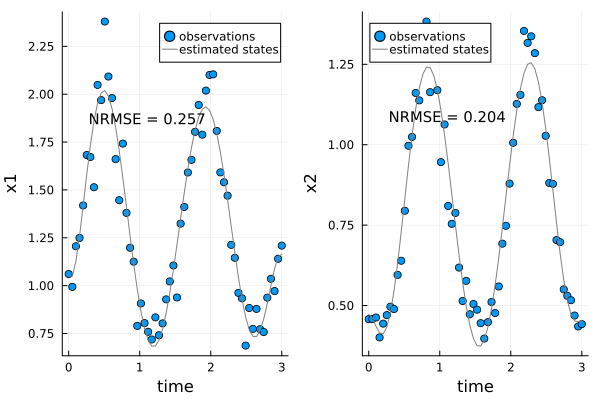
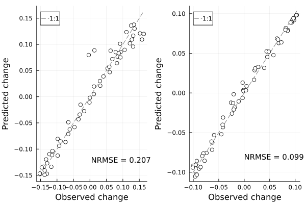
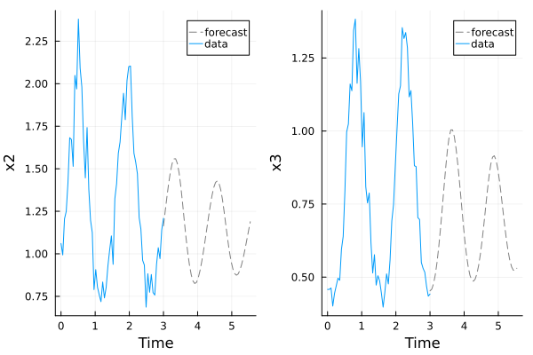

# UniversalDiffEq.jl

UniversalDiffEq.jl is a library for building universal dynamic equations (UDEs) and neural ordinary differential equations (NODEs). These models use neural networks to learn unknown nonlinear relationships from time series data. The package provides model constructor functions to build discrete and continuous time models that combine known parametric functions with unknown functions represented by neural networks. UniversalDiffEq.jl allows users to choose between several training routines to fit the to data, including state-space modeling procedures that increase the stability of the training routine on noisy and highly variable data sets. The package leverages the Julia scientific machine learning (SciML) ecosystem to build and train the models. The term "universal" comes from the [universal approximation theorem](https://en.wikipedia.org/wiki/Universal_approximation_theorem).

## Universal dynamic equations

Universal dynamic equations include two classes of models: universal differential equations and universal difference equations. Universal differential equations are continuous-time models that learn the right-hand side of a system of ordinary differential equations from time series data

```math
\frac{du}{dt} = f(u).
```

Universal difference equations are discrete-time models that learn the right-hand side of a system of difference equations

 ```math
u_{t+1} = u_{t} + f(u).
```

In the simplest case, a neural network ``NN`` represents the entire right-hand side of the model ``f(\mathbf{x}) = NN(\mathbf{x})``. These models are sometimes called neural ordinary differential equations (NODEs). However, in general, the right-hand side of the model can include both neural networks and parametric functions. For example, the classic Lotka-Volterra predator-prey model includes a growth term for the prey ``rN``, a mortality rate for the predator ``mP``, and a linear interaction term between the two species ``\alpha NP``. We can use universal differential equations to build a more flexible version of this model by replacing the linear interaction term with a neural network

```math
\frac{dN}{dt} = rN - NN(N,P)

\\

\frac{dP}{dt} = \theta NN(N,P) - mP.
```

We can train the neural network ``NN`` and estimate the biological parameters ``r``, ``m``, and ``\theta`` from time series data using the training routines defined in UniversalDiffEq.jl.

## How UniversalDiffEq.jl works


UniversalDiffEq.jl provides functions for four stages of analysis: model building, training, performance evaluation, and analysis. The package provides three main model constructor functions: `CustomDerivatives`, `CustomDifferences`, and `NODE`. `CustomDerivatives`, builds a universal differential equation based on a user-defined function that describes the right-hand side of a differential equation. `CustomDifferences` provides the same functionality for discrete-time models.`NODE` builds a neural ordinary differential equation and only requires a data set from the user (although it has additional key work arguments). Each of these functions has an equivalent with the prefix “Multi” (e.g. `MultiCustomDerivatives`) to build models for data sets that include multiple time series with similar dynamics. The following block of code shows how to build a UDE model that represents predatory prey interactions using the `CustomDerivatives` function.

```julia
using UniversalDiffEq, DataFrames


# Generate synthetic predator-prey data
data,plt = UniversalDiffEq.LotkaVolterra() 


# Build feed-forward neural network with two inputs and one output
NN,params = UniversalDiffEq.SimpleNeuralNetwork(2,1)


# Set model parameters estimating 
init_parameters = (NN = params, r = 0.1, k = 10.1, m = 0.1, theta = 0.1)


# Define right-hand side of the UDE model
function dudt(u,p,t)


   C = abs(NN(u,p.NN)[1]) # Calculate prey consumption rate with neural network
   r, k, theta, m = abs.([p.r, p.k, p.theta, p.m]) # transform model parameters to get positive values


   # Calculate rates of change for prey u[1] and predator u[2]
   dx1 = r*u[1]*(1-u[1]/k) - C
   dx2 = theta*C - m*u[2]


   return [dx1,dx2]
end

# Construct UDE model using the CustomDerivatives function
model = CustomDerivatives(data,dudt,init_parameters)
```

The next step is fitting the model to the data using the `train!` function. The `train!` function builds a loss function for the model from the model structure and data sets provided by the user. It then runs an optimization algorithm to update the model parameters. The loss function and optimization algorithm used can be supplied using keyword arguments. The flowing block calls `train!` and specifies the derivative matching loss function and the ADAM gradient descent optimization algorithm. The different loss functions, optimization algorithms, and the remaining keyword arguments are discussed in detail on the “Training routines” page.  


```julia
# Use the train function to fit the model to the data
train!(model;  loss_function = "derivative matching",
              optimizer = "ADAM",
              regularization_weight = 0.0,
              verbose = false,
              loss_options = (d = 10, ),
              optim_options = (maxiter = 1000, step_size = 0.01))
```   

Two primary functions are provided to test the performance of the model on in sample data, `plot_predictions` and `plot_state_estimates.` Care should be taken when using these functions because their interpretation depends on the training procedure used to fit the models. Each training does two things: 1) updates the parameters of the UDE model to match the dynamics observed in the data set, and 2) estimates the value of the state variables, assuming the observation in the data set includes some observation error. The plot state estimates function compares the estimated state variables to the observations in the data set. In contrast, the plot predictions function compares the changes observed in the estimated state variables to those predicted by the UDE model.  


For example, the derivative matching algorithm used in this example first fits a smooth curve to the data set using a spline regression and then trains the model by comparing the derivatives of the smoothing curve to the derivatives of the UDE model. The plot state estimates function shows the predictions of the smoothing curve, while the plot predictions show how well the predictions made with the UDE match the smoothing curve. In this case, the smoothing curve fit by the derivative matching algorithm is a good fit to the data set. 


```julia
# Compare the smoothing curve to the data 
plot_state_estimates(model)
```



The one-step-ahead forecasts of the UDE model also match the changes in the estimated states quite set well. 
```julia
# Compare predicted to observed changes
plot_predictions(model)
```



The performacne of the model on outof sample data can be estimated using leave future ot cross validation using the  `leave_future_out_cv` function. 

Finally, the package includes several functions to analyze the dynamics predicted by the model. The simplest of these is the plot forecast function `plot_forecast`, which simulates the UDE model for a fixed number of time steps. The `get_right_hand_side` function allows the user to access the derivatives of the UDE model to analyze as you might any other differential equation model. Other more specific fuctions are also provided and documented in the API. 
  
```julia
# plot forecast
p1, (p2,p3) = UniversalDiffEq.plot_forecast(model, 50)
p1
```



## Data types

UniversalDiffEq.jl can train models on individual time series ``y_t`` or multiple time series ``y_{i,t}`` from systems with similar dynamics. Separate model constructors are provided for models trained on single and multiple time series. UniversalDiffEq.jl allows the models trained on multiple time series to include parameters that have different values for each time series in the training set.

UniversalDiffEq.jl can accommodate irregularly sampled data. Data for continuous-time models can be sampled at any point in time, while discrete-time models require integer-valued time steps between observations. UniversalDiffEq.jl does not accommodate observations that are missing a subset of the state variables. In these cases, data imputation is necessary.

Models built with UniversalDiffEq.jl can incorporate covariates ``X_t`` that influence the dynamics of the primary state variables. Discrete-time models require the observations of the covariates to match the time when the state variables were observed.

## Package contents
```@contents
Pages = ["Models.md","TrainingRoutines.md","MultipleTimeSeries.md", "ModelTesting.md","CrossValidation.md", "NutsAndBolts.md","modelanalysis.md","examples.md","API.md"]
```
